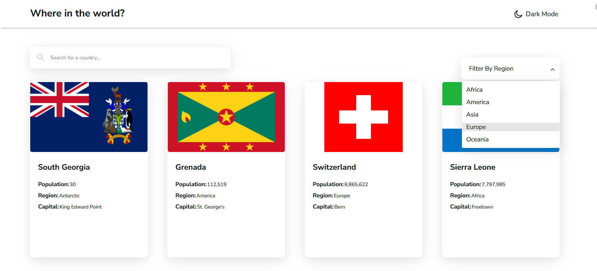
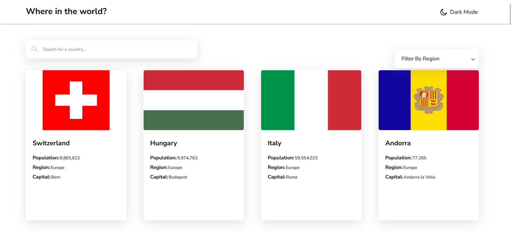
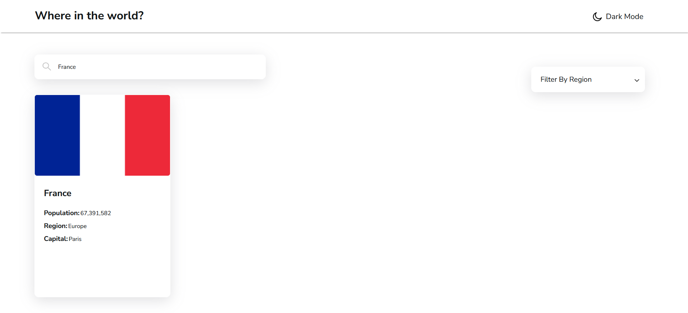
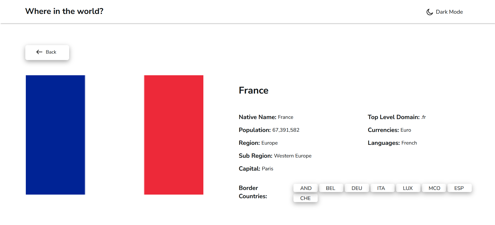

<h1 align="center">COUNTRIES WEBSITE BY BLUZ0</h1>

### Light Mode Page

First page landing with all countries including their names, population, region and capital

Here i'm trying to choose a specific region with the filter button, in this example i choose Europe

And here we go, we got countries from the Europe region

We also got a search bar. You can choose the country that you want, just make sure to don't mistyped the name of the country

You can click the country of your choice and get all the details you want (cocorico !)

### Dark Mode Page

Same landing page but with dark mode on

